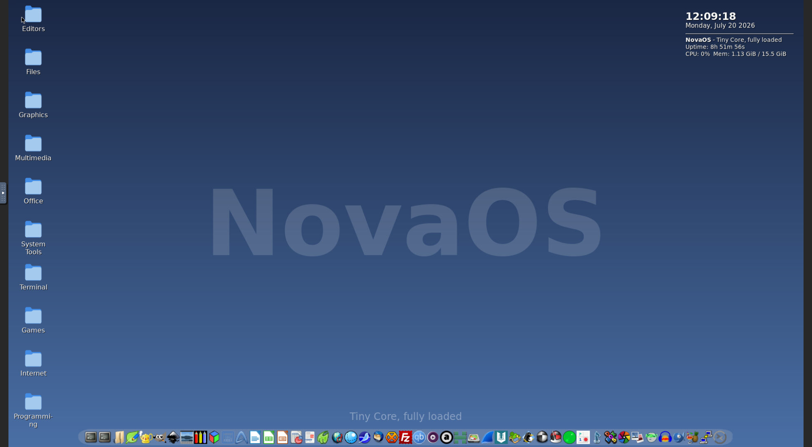

# NovaOS

**A complete, fully-loaded desktop operating system that runs in your browser.**
Built on Tiny Core Linux, running at native speed inside a container — no VM, no
install wizard, no dual-boot. One command and it's just... there.

[](https://github.com/bhouvana/NovaOS)
[](LICENSE)
[](https://ghcr.io/bhouvana/novaos)
[](#what-you-get)



**[Get it running](#get-it-running)** ·
**[What you get](#what-you-get)** ·
**[How it works](#how-it-works)** ·
**[Run it manually](#running-it-yourself-manually)** ·
**[Contributing](#contributing)**

## Why NovaOS

- **It's a real desktop, not a demo.** Every app in the menu actually launches and
  actually works — verified one by one, not just "installed and hoped for."
- **No VM, no emulation, no waiting.** NovaOS `chroot`s straight into a real Linux
  userland sharing the host's kernel, so it runs at native container speed.
- **It fits in a browser tab.** Open a URL, get a full desktop — a terminal, a
  compiler, an office suite, games, and a package manager — with nothing installed
  on your actual machine except Docker.
- **Curated, not dumped.** ~650 packages chosen to work together and stay out of
  each other's way, with the full 3,500-package Tiny Core repository still one
  click away through the built-in Software Center.

## Get it running

Never touched Docker before? Doesn't matter — paste one of these into your terminal
and everything (including Docker itself, if you don't have it) gets set up for you.

**macOS / Linux:**
```sh
curl -fsSL https://raw.githubusercontent.com/bhouvana/NovaOS/master/deploy/install.sh | bash
```

**Windows (PowerShell):**
```powershell
irm https://raw.githubusercontent.com/bhouvana/NovaOS/master/deploy/install.ps1 | iex
```

That's it. Your browser opens to `http://localhost:8080` with the full desktop running.

> **One honest caveat**: on a machine that's never had Docker before, Windows and
> macOS both require Docker Desktop, which is a signed installer neither Apple nor
> Microsoft let any script fully automate — it may ask you to finish one manual step
> (launching it once, or a restart if WSL2 wasn't already enabled on Windows). If that
> happens, the script tells you exactly what to do — just run the same command again
> afterward and it picks up right where it left off. Linux needs none of this; Docker
> installs completely unattended there.

## What you get

A real desktop, not a tech demo — right-click for a full categorized app menu, use
the taskbar at the bottom, double-click a desktop folder icon, or hit **Alt+Space**
for a fuzzy-search app launcher. All four are the same underlying menu, just four
different ways to get to it.

| | |
|---|---|
| **Packages** | ~650, curated |
| **App categories** | 10 (Editors, Graphics, Office, Internet, Multimedia, Games, Programming, System Tools, Files, Terminal) |
| **Full repo on demand** | 3,500+ packages via the in-desktop Software Center |
| **Boot time** | Seconds — it's a container, not a VM |

- **Terminal** with a real shell — `git`, `gcc`, `python3`, `vim`, `tmux`, and more
  are all there and usable, not just installed for show.
- **Programming languages**: Python, Ruby, PHP, Node.js, Go, R, Lua, Mono (C#), plus
  the usual build toolchain — `cmake`, `gdb`, `clang`, `valgrind`, `ccache`
- **Office & productivity**: LibreOffice, AbiWord, Gnumeric, GIMP, Inkscape, Darktable,
  Lite XL, gThumb, Photoflare, mupdf
- **Internet**: Midori, Dillo, NetSurf, SeaMonkey, Thunderbird, HexChat, qBittorrent,
  Transmission, Sylpheed, PuTTY, Remmina
- **Media**: mpv, Audacity, Audacious, DeaDBeeF, QMPlay2, HandBrake, Brasero
- **Games & emulation**: Doom, SuperTux, Neverball/Neverputt, Luanti (Minetest,
  compiled from source), DOSBox-X, MAME, SNES9x, Chess, Minesweeper, Bubble Shooter,
  and the full solitaire family
- **System & security tools**: Wireshark, nmap, hashcat, Samba, testdisk, fastfetch
- **Software Center**: install anything else live, from Tiny Core's 3,500+ package
  repository, without rebuilding or restarting anything

None of this is a curated demo subset — it's the actual, working thing.

## How it works

No QEMU, no nested virtualization. NovaOS chroots straight into a real Tiny Core
Linux userland assembled at build time, running at native container speed (Docker
containers already share the host kernel — that's the whole trick). `Xvfb` provides
the display, `x11vnc` + `noVNC` bridge it to your browser.

- [`Dockerfile`](Dockerfile) — the build, in three stages: the curated ~650-package
  desktop, Minetest compiled from source (no prebuilt package exists for it), then the
  runtime scripts layered on last so editing them doesn't force a rebuild of the
  expensive stuff. Curated on purpose rather than "all 3,500 Tiny Core packages" —
  Tiny Core's own package model assumes each one stays isolated in its own
  loop-mount, so a lot of them ship files that intentionally shadow another
  package's files; that's safe under TC's live model but becomes silent file
  corruption once everything gets flattened into one merged rootfs at build time
  the way this image does. The Software Center still gives you the full repository
  on demand, just without baking in that collision risk or the multi-GB size cost.
- [`deploy/build-tinycore.sh`](deploy/build-tinycore.sh) — resolves and merges the
  package set from Tiny Core's live repo, in parallel.
- [`deploy/chroot-start.sh`](deploy/chroot-start.sh) — runs inside the chroot: X
  server, window manager, taskbar, desktop icons, wallpaper, the right-click menu,
  the Software Center.
- [`deploy/entrypoint.sh`](deploy/entrypoint.sh) — the container's actual entry point:
  sets up what device access it can, starts the chroot, bridges to the browser.

Running with `--privileged` (which the install scripts do for you) is what makes the
in-desktop terminal work — it needs a real `devpts` mount, which unprivileged
containers can't provide. Without it, everything else still works, just without a
terminal.

## Running it yourself, manually

<details>
<summary>Skip the install script and run the container directly</summary>

```sh
docker pull ghcr.io/bhouvana/novaos:latest
docker run -d --name novaos --restart unless-stopped -p 8080:8080 -e PORT=8080 --privileged \
  -v novaos-home:/opt/novaos/tc-root/root \
  -v novaos-tce:/opt/novaos/tc-root/etc/sysconfig/tcedir \
  ghcr.io/bhouvana/novaos:latest
# open http://localhost:8080
```

Or build it from source yourself (slower — compiles the whole desktop, including
Minetest, from scratch):

```sh
git clone https://github.com/bhouvana/NovaOS.git
cd NovaOS
docker build -t novaos .
docker run -d --name novaos --restart unless-stopped -p 8080:8080 -e PORT=8080 --privileged \
  -v novaos-home:/opt/novaos/tc-root/root \
  -v novaos-tce:/opt/novaos/tc-root/etc/sysconfig/tcedir \
  novaos
```

The two `-v` volumes are what make NovaOS feel like a real second OS instead of a
demo that forgets everything: your files, settings, and anything installed through
the Software Center survive container restarts and even NovaOS image updates. The
rest of the system (apps, games, the desktop itself) always comes from the image, so
pulling a newer NovaOS still gets you the update instead of a frozen copy.

</details>

## Contributing

Issues and pull requests are welcome — bug reports, package suggestions, and fixes
for anything that doesn't work as advertised are all fair game. If you're adding a
new app to the menu, a quick note on how you verified it actually launches (not just
that it installed) goes a long way, given how much of this project has been about
exactly that distinction.

## License

[MIT](LICENSE)
