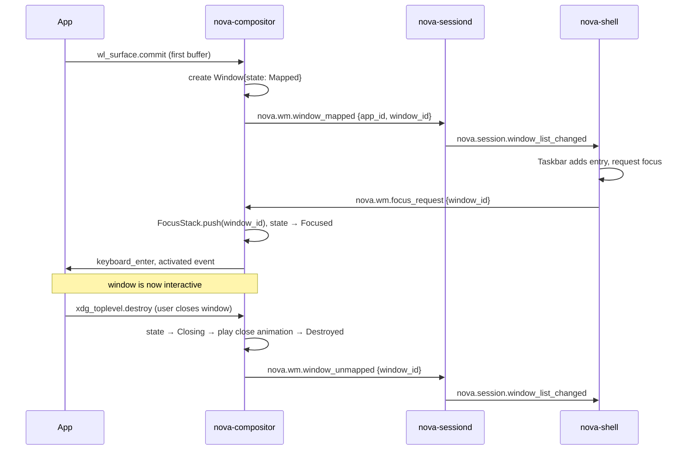
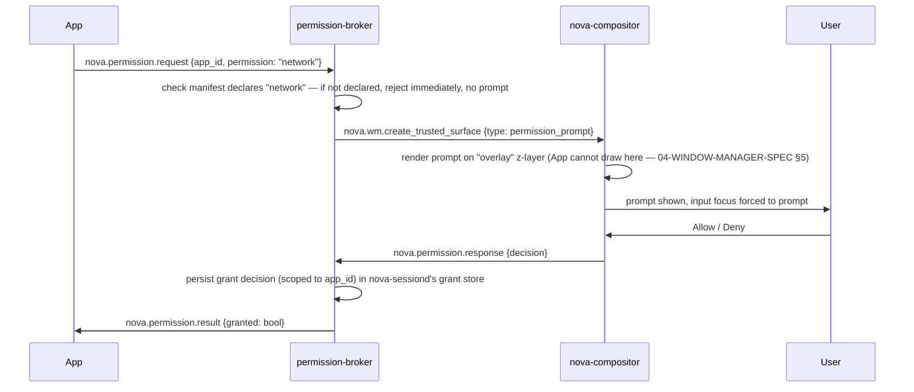

# Spec 01 — Component Interaction Flows

Status: Draft v0.1 · Last updated: 2026-07-18

Every flow below names the concrete component (not the layer) and the concrete Nova Bus
topic or direct call involved. Components are those defined in
[../02-REPOSITORY-STRUCTURE.md](../02-REPOSITORY-STRUCTURE.md); bus topic naming follows
[../11-CODING-STANDARDS.md](../11-CODING-STANDARDS.md) §1.

## 1. App Launch (icon click → pixels on screen)

```text
User clicks icon in nova-shell (Taskbar or Launcher)
   ↓
nova-shell: resolves app id → calls nova-sessiond.LaunchApp(app_id)
   over Nova Bus, method call, topic "nova.session.launch"
   ↓
nova-sessiond: resolves .novapkg mount at /nova/apps/<id>/<version>/
   reads manifest.toml → validates sdk_version compatibility
   ↓
nova-sessiond → permission-broker: BuildSandboxPlan(manifest.permissions)
   returns concrete namespace/seccomp/Landlock ruleset (ADR-0010)
   ↓
nova-sessiond: clone() into new PID/mount/net namespaces per plan,
   seccomp filter installed, Landlock rules applied, cgroup-v2 slice created
   ↓
nova-sessiond: execve() the app binary inside the sandbox
   ↓
App process starts → nova-app::run() → App::new(context) → App::on_launch()
   ↓
App (via sdk/nova-app): creates a Wayland surface, connects to
   nova-compositor's Wayland socket (handed to it via the sandbox's
   restricted mount of /run/nova/wayland-0)
   ↓
nova-compositor: new surface event → allocates scene-graph node,
   assigns initial z-order layer "normal" (04-WINDOW-MANAGER-SPEC §5)
   ↓
App (via sdk/nova-ui): builds initial widget tree → layout pass → paint
   → submits first frame buffer to compositor
   ↓
nova-compositor: damage-tracks the new surface's region, includes it in
   next frame's render pass (04-WINDOW-MANAGER-SPEC §7)
   ↓
nova-compositor: DRM page-flip → GPU → screen
   ↓
nova-sessiond → nova-shell: publishes "nova.session.app_started" event
   (pub/sub) → Taskbar adds the running-app entry
```

**Failure paths**: manifest `sdk_version` mismatch → `nova-sessiond` returns an error to
`nova-shell` before any process is spawned, surfaced as a notification
(§4). Sandbox construction failure → same. Crash after launch → `nova-sessiond`'s
liveness watcher ([../03-DESKTOP-ARCHITECTURE.md](../03-DESKTOP-ARCHITECTURE.md) §6)
detects process exit, applies bounded-retry policy, then notifies.

## 2. Window Open / Focus / Close



Full window state machine in
[04-WINDOW-MANAGER-SPEC.md](04-WINDOW-MANAGER-SPEC.md) §2.

## 3. Notification Publish → Display

```text
Any app (via sdk/nova-notify): Notification::builder()...build().send()
   ↓
sdk/nova-notify: checks locally-cached permission grant (notifications=true
   in own manifest); if absent, call fails client-side, no bus round-trip
   ↓
Nova Bus (novabusd): publish on topic "nova.notify.publish"
   broker ACL check: does this app_id's connection have the
   "notifications" grant recorded by nova-sessiond at sandbox creation? →
   reject at broker if not (defense in depth vs. a compromised app)
   ↓
nova-shell (Notification Center, subscribed to "nova.notify.publish"):
   receives message → checks Do-Not-Disturb state → renders toast
   ↓
nova-shell: appends to persistent notification history
   ([../03-DESKTOP-ARCHITECTURE.md](../03-DESKTOP-ARCHITECTURE.md) §5)
```

## 4. Permission Prompt (first use of a runtime-gated permission)



This is why the permission-prompt surface is a compositor-owned, protocol-level concept
([ADR-0003](../decisions/ADR-0003-compositor-and-display-protocol.md) Consequences;
[08-SECURITY-MODEL.md](../08-SECURITY-MODEL.md) §3) rather than an app-drawn dialog: the
requesting app never has a code path that can render pixels into the prompt's region.

## 5. Package Install

```text
User: Package Center search → select app → click Install
   ↓
Package Center (apps/nova-package-center, itself a sandboxed SDK app):
   calls novapkg-agent.Install(app_id) over Nova Bus
   ↓
novapkg-agent: fetch catalog entry (cached or refreshed) → download
   .novapkg from Nova Store CDN → verify header magic + size
   ↓
novapkg-agent: SHA-256 checksum of SquashFS payload vs. header-declared
   hash → reject on mismatch (fast, cheap corruption check)
   ↓
novapkg-agent: Ed25519 signature verify (header+payload) against trusted
   keyring in /nova/config/trusted-keys/ → reject on failure
   (07-PACKAGE-FORMAT-SPEC.md §4)
   ↓
novapkg-agent: mount SquashFS read-only at
   /nova/apps/<id>/<version>/, write manifest copy to
   /nova/apps/<id>/current -> symlink to this version
   ↓
novapkg-agent → nova-sessiond: nova.session.register_app {manifest}
   (Launcher index rebuild, per 03-DESKTOP-ARCHITECTURE.md §3)
   ↓
novapkg-agent → Package Center: nova.package.install_complete
   ↓
Package Center: show "Installed" state, offer "Open"
```

## 6. Settings Change Propagation (example: theme switch)

```text
User: Nova Settings → Appearance → selects "Dark"
   ↓
Nova Settings (sandboxed SDK app) → nova-settings-api:
   Settings::set("nova.theme.mode", "dark")
   ↓
sdk/nova-settings-api → nova-themed: nova.settings.write
   {key, value} (permission-gated: only Nova Settings has
   write access to system-scoped keys, enforced at broker ACL)
   ↓
nova-themed: persists to /nova/config/theme.toml, recomputes
   the active token set, publishes "nova.theme.changed" {tokens}
   ↓
Every live Nova UI instance (subscribed at startup):
   receives new token set → nova-ui re-themes without restart
   (05-NOVA-UI-TOOLKIT-SPEC.md §6) → next paint reflects new theme
```

## 7. OS Update (background discovery → applied)

Full flow already sequenced in
[../05-PACKAGE-AND-UPDATE-SYSTEM.md](../05-PACKAGE-AND-UPDATE-SYSTEM.md) §5; the bus/
component-level detail: `update-agent` (periodic wake, not resident) → HTTPS GET manifest
from update channel → if newer, download to inactive slot → verify (same signature
mechanism as §5 above, sharing code with `novapkg-agent`'s verifier) → publish
`nova.update.available` → `nova-shell` notification (§3 flow) → on user confirm or next
reboot, `update-agent` calls into `system/update/` bootloader-slot-switch tool → reboot.

## 8. Boot (component start order)

See [03-BOOT-TIMELINE.md](03-BOOT-TIMELINE.md) for the timed version; this is the
message-level view of the last few milestones from
[../01-SYSTEM-ARCHITECTURE.md](../01-SYSTEM-ARCHITECTURE.md) §2:

```text
OpenRC starts novabusd (first Nova process, everything else depends on
   its Unix socket existing)
   ↓
OpenRC starts nova-sessiond → connects to novabusd → publishes
   "nova.session.starting"
   ↓
OpenRC starts nova-compositor → connects to novabusd → performs DRM/KMS
   modeset → takes display ownership from the early boot-animation
   client (seamless flip, no black frame — 03-BOOT-TIMELINE.md §3)
   → publishes "nova.wm.ready"
   ↓
nova-sessiond (subscribed to "nova.wm.ready"): now safe to launch
   session-critical UI → starts nova-shell as a privileged (non-
   sandboxed-app-permission-model, but still resource-limited) session
   process
   ↓
nova-shell: connects to compositor, renders Taskbar/Launcher surfaces,
   subscribes to "nova.theme.changed" and "nova.notify.publish"
   ↓
nova-sessiond: publishes "nova.session.ready" → boot animation client
   (still holding a reference) fades its overlay and exits
```

## 9. Browser-Demo Input (novaos.dev specific)

Fully specified in [08-BROWSER-ARCHITECTURE-SPEC.md](08-BROWSER-ARCHITECTURE-SPEC.md) —
not duplicated here since it involves a distinct component stack (browser DOM → v86 →
emulated PS/2/virtio devices) rather than Nova Bus messages.
