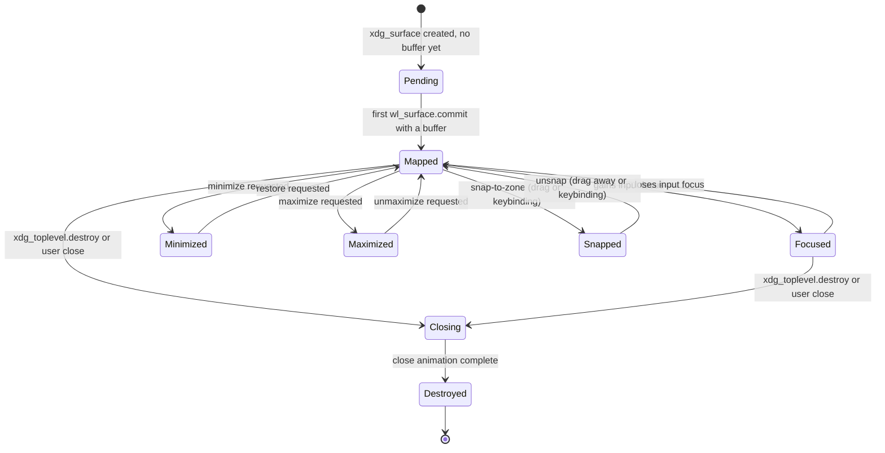

# Spec 04 — Window Manager Specification

Status: Draft v0.1 · Last updated: 2026-07-18

Concretizes [../03-DESKTOP-ARCHITECTURE.md](../03-DESKTOP-ARCHITECTURE.md) §2 and
[ADR-0003](../decisions/ADR-0003-compositor-and-display-protocol.md) for
`desktop/compositor/` (`nova-compositor`).

## 1. Window Lifecycle State Machine



Notes:
- `Minimized`, `Maximized`, `Snapped` are all reachable only from `Mapped`/`Focused` —
  a minimized window cannot be directly snapped; it must restore first. This keeps the
  state machine's transition table small and each transition's animation well-defined
  (§3), rather than an N×N matrix of cross-state animations.
- `Focused` is a sub-state, not a parallel dimension — exactly one window (or the
  permission-prompt overlay, §5) holds it system-wide, tracked by the `FocusStack` (§4).

## 2. Window State Data Model

```rust
struct Window {
    id: WindowId,
    app_id: AppId,
    state: WindowState,          // enum matching §1's diagram
    geometry: Rect,               // current position/size, output-local coords
    restore_geometry: Option<Rect>, // pre-maximize/snap geometry, for unmaximize/unsnap
    z_layer: ZLayer,              // §5
    title: String,
    decorations: DecorationMode,  // ClientSide (always, per ADR-0005/06-DESIGN-SYSTEM §4)
    output: OutputId,             // which monitor owns this window
    scale_factor: f32,            // inherited from `output` at map time, re-evaluated on output change
    damage: DamageRegion,         // §7
}
```

## 3. Animations

Every transition in §1 maps to exactly one animation, using the duration/easing tokens
from [10-DESIGN-BIBLE.md](10-DESIGN-BIBLE.md) §3 (not ad hoc per-transition values):

| Transition | Animation | Duration token | Easing token |
|---|---|---|---|
| Pending → Mapped | Scale 96%→100% + fade in | `motion.medium` (200ms) | `ease.decelerate` |
| → Minimized | Scale to taskbar-entry position, fade out | `motion.medium` (200ms) | `ease.accelerate` |
| Minimized → Mapped | Reverse of above | `motion.medium` (200ms) | `ease.decelerate` |
| → Maximized / → Snapped | Geometry tween to target rect | `motion.fast` (120ms) | `ease.standard` |
| → Closing → Destroyed | Scale 100%→96% + fade out | `motion.medium` (200ms) | `ease.accelerate` |

"Reduce motion" accessibility setting ([06-DESIGN-SYSTEM.md](../06-DESIGN-SYSTEM.md) §3)
collapses every animation above to an instant state change with no intermediate frames.

## 4. Focus Model

- **Model**: click-to-focus. Focus-follows-mouse is not implemented in v1 (adds
  complexity — hover-vs-intent disambiguation — for a pattern most users don't expect by
  default; revisit only on demonstrated demand).
- **Focus stack**: a single global `Vec<WindowId>`, most-recently-focused first. Alt-Tab
  walks this stack; clicking a window moves it to the front and raises its z-order
  within its layer (§5).
- **Focus on map**: a newly mapped window receives focus automatically unless launched
  with an explicit "background" hint (rare; matches
  [../08-SECURITY-MODEL.md](../08-SECURITY-MODEL.md) §2's `background` permission apps,
  which don't steal focus on relaunch/notification-triggered wake).
- **Focus and the permission-prompt surface**: forcibly takes and holds focus while
  visible ([01-INTERACTION-FLOWS.md](01-INTERACTION-FLOWS.md) §4) — the one exception to
  "click-to-focus," since it must be un-bypassable by design.

## 5. Z-Order Model

Five fixed layers, windows ordered by focus-stack recency within a layer, layers never
interleave:

```text
overlay            permission prompts, lock screen (08-SECURITY-MODEL §3)     [topmost]
always-on-top       user-pinned windows (e.g. a picture-in-picture player)
normal              default layer for all regular app windows
background          desktop-level surfaces (none in v1 — see 03-DESKTOP-ARCHITECTURE §8)
cursor              hardware cursor plane, always renders last               [bottom of list, visually topmost via separate KMS plane]
```

`cursor` is implemented as a separate DRM overlay plane where hardware supports it
(zero-recomposite cursor movement — a real GPU/CPU saving, not just a layering nicety),
falling back to compositor-drawn if the plane isn't available.

## 6. Drag & Resize

- **Drag**: grab initiated on the client-side-decoration title bar
  ([06-DESIGN-SYSTEM.md](../06-DESIGN-SYSTEM.md) §4); window follows pointer 1:1, no
  smoothing (smoothing on direct-manipulation gestures reads as lag, not polish).
- **Snap zones**: activated when the pointer crosses a screen-edge threshold (12px from
  edge, 96px from corner) while dragging; shows a translucent snap-preview at
  `overlay` layer before drop; on release, transitions to `Snapped` (§1) if a zone was
  active at drop time, otherwise a normal `Mapped` reposition.
- **Resize**: grab regions are the outer 6px of the window's client-side decoration
  border on all four edges/corners; live-resize (the app receives continuous
  `configure` events during drag, not just on release) since Nova UI's layout pass
  (§05-NOVA-UI-TOOLKIT-SPEC §3) is cheap enough to run per-frame.

## 7. Compositor Pipeline & Damage Tracking

```text
Input event (pointer/keyboard/touch)
   ↓
Hit-test against scene graph (top layer to bottom, first hit wins)
   ↓
Dispatch to focused/hit client, OR handled by compositor itself
   (window-manager gestures: Alt-Tab, snap-drag, workspace switch)
   ↓
Scene graph mutation (if any): window moved/resized/state changed
   ↓
Damage accumulation: each surface that changed (new client frame,
   moved, resized, or a compositor-drawn element like a snap-preview)
   adds its bounding rect (output-local coords) to that output's
   DamageRegion for the next frame
   ↓
Frame scheduling (§8) — wait for next vblank
   ↓
Render pass: for each output, if DamageRegion is non-empty, walk the
   scene graph top-to-bottom within the damaged rects only, composite
   into the back buffer (skip fully-undamaged outputs entirely — no
   render call issued)
   ↓
DRM page-flip (front/back buffer swap) on vblank
   ↓
Clear DamageRegion for that output
```

Damage regions are stored as a small merged list of non-overlapping rects (not a
per-pixel bitmap) — merged when two damaged rects overlap or are within a small
proximity threshold, capped at 8 rects per output before falling back to "damage whole
output" (avoids pathological many-small-damage-rect cases costing more in bookkeeping
than a full repaint would).

## 8. Frame Scheduling

- Compositor requests a `vblank` callback per output via DRM; rendering work for that
  output is only performed inside the callback, never eagerly — this is what makes
  "skip render for undamaged frames" (§7) actually save CPU/GPU/power rather than just
  save a composite step while still burning a frame's worth of work.
- Frame budget: 16.6ms (60Hz reference output) per
  [../09-PERFORMANCE-STRATEGY.md](../09-PERFORMANCE-STRATEGY.md) §2; if a frame's
  render pass exceeds budget, it is allowed to complete (never torn/aborted
  mid-frame) and the next vblank's callback is skipped if it would otherwise start
  before the GPU has caught up (bounded latency over strict frame-rate).
- Client frame-rate throttling: a client (app) that commits faster than the output's
  refresh rate has its `wl_surface.frame` callback throttled to vblank cadence — clients
  never get more frame callbacks than the display can show, bounding wasted app-side
  render work.

## 9. Multi-Monitor & HiDPI

- Each `Output` carries its own scale factor (integer or fractional, e.g. `1.0`, `1.5`,
  `2.0`); a window's `scale_factor` (§2) is inherited from whichever output contains the
  majority of its geometry, re-evaluated on every `configure`-triggering move.
- Nova UI ([05-NOVA-UI-TOOLKIT-SPEC.md](05-NOVA-UI-TOOLKIT-SPEC.md) §2) renders vector
  content at the window's current scale factor directly — no bitmap-then-upscale path
  ever exists in the pipeline, so there is no blur state to accidentally regress into.
- Workspaces are per-output-set (all outputs share one workspace index) in v1 —
  per-output independent workspaces are a `14-FUTURE-VISION.md`-class deferral, not
  a v1 requirement.
