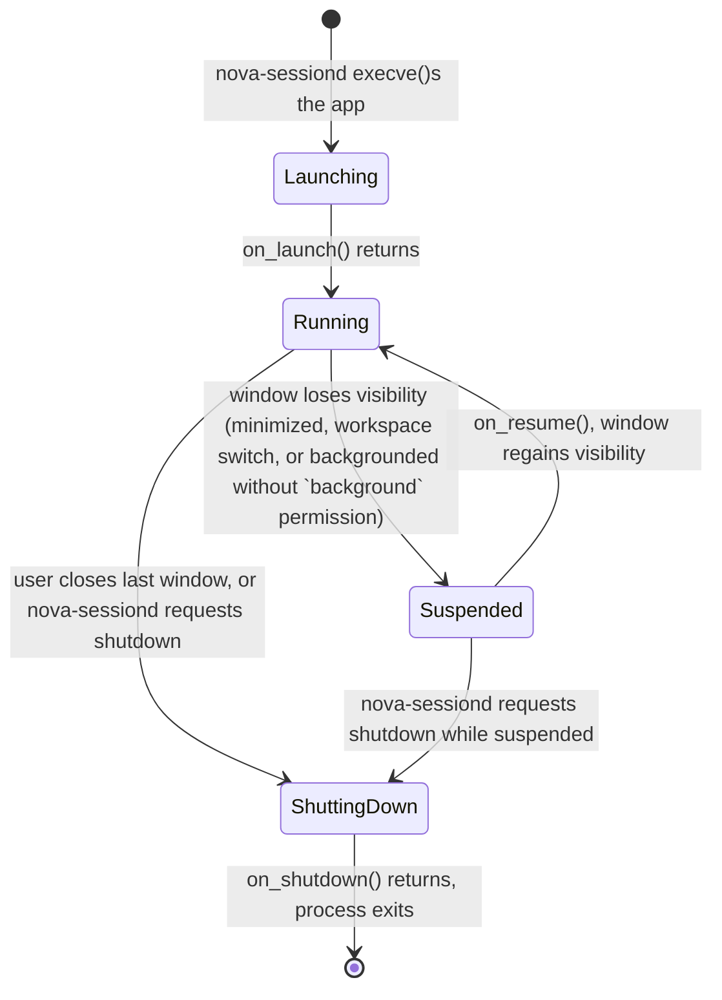

# Spec 06 — Nova SDK Specification

Status: Draft v0.1 · Last updated: 2026-07-18

Concretizes [../04-APPLICATION-FRAMEWORK-AND-SDK.md](../04-APPLICATION-FRAMEWORK-AND-SDK.md)
into real API signatures.

## 1. App Entrypoint

```rust
trait App {
    fn new(ctx: &AppContext) -> Self where Self: Sized;
    fn on_launch(&mut self, ctx: &mut AppContext);
    fn on_window_event(&mut self, ctx: &mut AppContext, event: WindowEvent);
    fn on_suspend(&mut self, ctx: &mut AppContext);
    fn on_resume(&mut self, ctx: &mut AppContext);
    fn on_shutdown(&mut self, ctx: &mut AppContext);
}

fn nova_main<A: App>() -> ! { /* sdk/nova-app runtime entry, generated by
                                   #[nova_app] macro on the app's main() */ }
```

`AppContext` is the app's single handle into the SDK: `ctx.window()`, `ctx.storage()`,
`ctx.notify()`, `ctx.settings()`, `ctx.clipboard()` — one object, so an app never
constructs SDK clients itself (they're pre-authenticated to the sandbox's Nova Bus
connection at `nova_main` startup, per
[01-INTERACTION-FLOWS.md](01-INTERACTION-FLOWS.md) §1).

## 2. Lifecycle State Machine



An app with the `background` permission
([../08-SECURITY-MODEL.md](../08-SECURITY-MODEL.md) §2) skips the `Suspended` transition
when backgrounded — it stays `Running`. This is the only branch in the lifecycle gated
by a manifest permission.

## 3. Manifest Schema (full)

```toml
[app]
id = "dev.novaos.files"          # reverse-DNS, immutable once published
name = "Nova Files"
version = "1.2.0"                # publisher-controlled, monotonically increasing
sdk_version = "^1.0"             # semver range against the running SDK
icon = "assets/icon.svg"
category = "utilities"           # one of a fixed enum, drives Launcher grouping
summary = "Browse and manage your files"
homepage = "https://novaos.dev/apps/files"  # optional

[window]
default_size = [960, 640]
min_size = [480, 360]
resizable = true
multi_window = false             # true for apps like Nova Files that support
                                  # multiple open windows sharing one process

[permissions]
filesystem = ["home", "downloads"]     # named scopes, see 08-SECURITY-MODEL §2
filesystem_user_selected = true        # broker-mediated file picker access
notifications = true
network = false
background = false
ipc_topics = []                        # extra Nova Bus topics beyond the default set

[assets]
localization_dir = "assets/i18n"       # see §6
default_locale = "en-US"

[settings]
schema = "assets/settings-schema.toml" # see §7, optional — omit if the app has no
                                        # user-configurable settings
```

## 4. Storage API (`sdk/nova-storage`)

```rust
trait Storage {
    fn kv(&self) -> &KvStore;
    fn files(&self) -> &FileStore;
    fn secrets(&self) -> &SecretStore;
}

trait KvStore {
    fn get(&self, key: &str) -> Option<Value>;
    fn set(&self, key: &str, value: Value) -> Result<()>;
    fn watch(&self, key: &str) -> Subscription<Value>;  // for reactive UI updates
}

trait FileStore {
    fn open(&self, path: &RelativePath, mode: OpenMode) -> Result<File>;
    fn list(&self, dir: &RelativePath) -> Result<Vec<Entry>>;
    // All paths are relative to /nova/data/<app_id>/ — no absolute paths accepted,
    // structurally impossible to escape the app's storage scope (08-SECURITY-MODEL §5)
}

trait SecretStore {
    fn get(&self, key: &str) -> Result<Option<SecretBytes>>;   // decrypted on read
    fn set(&self, key: &str, value: SecretBytes) -> Result<()>; // encrypted at rest
    fn delete(&self, key: &str) -> Result<()>;
}
```

`FileStore` data survives app updates (new `.novapkg` version, same `app_id`) but not
uninstall unless the user confirms "keep data"
([../05-PACKAGE-AND-UPDATE-SYSTEM.md](../05-PACKAGE-AND-UPDATE-SYSTEM.md) §2).

## 5. Notifications, Settings, Clipboard APIs

```rust
// sdk/nova-notify
Notification::builder()
    .title("Download complete")
    .body("report.pdf saved to Downloads")
    .icon(NotificationIcon::AppDefault)
    .action("Open", ActionId::new("open_file"))   // fires App::on_window_event
                                                    // with a NotificationAction event
    .build()
    .send(ctx.notify())?;

// sdk/nova-settings-api
let value: bool = ctx.settings().get("dark_mode_follows_system")?;   // own-app setting,
                                                                        // defined in §7's schema
let theme: ThemeMode = ctx.settings().get_system("nova.theme.mode")?; // read-only access
                                                                        // to system settings
                                                                        // an app declared
                                                                        // interest in

// sdk/nova-clipboard
ctx.clipboard().write(ClipboardData::text("copied string"))?;
let data: Option<ClipboardData> = ctx.clipboard().read()?;   // typed MIME-tagged data,
                                                                // never a raw byte blob
                                                                // with no type info
```

## 6. Localization

- `assets/i18n/<locale>.ftl` — Fluent-format resource files (chosen for its
  pluralization/grammar handling over a bare key-value format), one per supported
  locale.
- Fallback chain: exact locale (`fr-CA`) → language (`fr`) → `default_locale` from the
  manifest → hardcoded English string embedded in code as the absolute last resort (so a
  missing translation never produces a blank label).
- `sdk/nova-ui` text widgets accept a `LocalizedString` key, resolved through this chain
  at paint time against the system's active locale
  (`nova.settings.system.locale`) — not resolved once at startup, so a live locale
  change (rare, but symmetrical with live theme changes, §05-NOVA-UI-TOOLKIT-SPEC §6)
  is possible without an app restart.

## 7. Settings Schema (app-defined)

```toml
# assets/settings-schema.toml
[[setting]]
key = "dark_mode_follows_system"
type = "bool"
default = true
label = "settings.dark_mode_follows_system.label"   # localization key, §6

[[setting]]
key = "grid_size"
type = "enum"
options = ["small", "medium", "large"]
default = "medium"
label = "settings.grid_size.label"
```

Nova Settings ([../03-DESKTOP-ARCHITECTURE.md](../03-DESKTOP-ARCHITECTURE.md) §1) reads
every installed app's schema to render a generic per-app settings page without that app
needing to build its own settings UI — consistent with
[../06-DESIGN-SYSTEM.md](../06-DESIGN-SYSTEM.md) §1's "no app hand-rolls its own chrome"
principle extended to settings screens.

## 8. Drag-and-Drop

```rust
// Source side
ctx.clipboard().begin_drag(ClipboardData::files(vec![path]), DragIcon::from(&thumbnail));

// Target side (widget-level, via Widget::handle_event, §05-NOVA-UI-TOOLKIT-SPEC §2)
InputEvent::DragEnter(data) => /* show drop-accepting highlight */
InputEvent::Drop(data) => /* consume ClipboardData */
```

Cross-app drag-and-drop is broker-mediated the same way the file picker is
([../08-SECURITY-MODEL.md](../08-SECURITY-MODEL.md) §2 `filesystem_user_selected`
row) — the drop target receives a granted file handle for dropped files, not a raw
path into the source app's sandbox.

## 9. Plugin Hosting API (`sdk/nova-plugin`)

```rust
trait PluginHost<P: Plugin> {
    fn discover(&self) -> Vec<PluginManifest>;   // from the app's own plugin directory
                                                   // convention, app-defined
    fn load(&self, manifest: &PluginManifest) -> Result<PluginHandle<P>>;
}

trait Plugin {
    // app-domain-specific trait, e.g. Nova Paint defines `trait FilterPlugin`
}
```

`nova-plugin` provides discovery/sandboxed-process hosting mechanics only; the `Plugin`
trait itself is defined per-app, per
[../04-APPLICATION-FRAMEWORK-AND-SDK.md](../04-APPLICATION-FRAMEWORK-AND-SDK.md) §6.

## 10. Versioning & Compatibility Enforcement

`nova-sessiond` checks `sdk_version` (§3) against the running SDK's version before
`execve()` (step 3 of [01-INTERACTION-FLOWS.md](01-INTERACTION-FLOWS.md) §1) — a
semver-range check, implemented once in `nova-sessiond`, not duplicated per SDK module.
