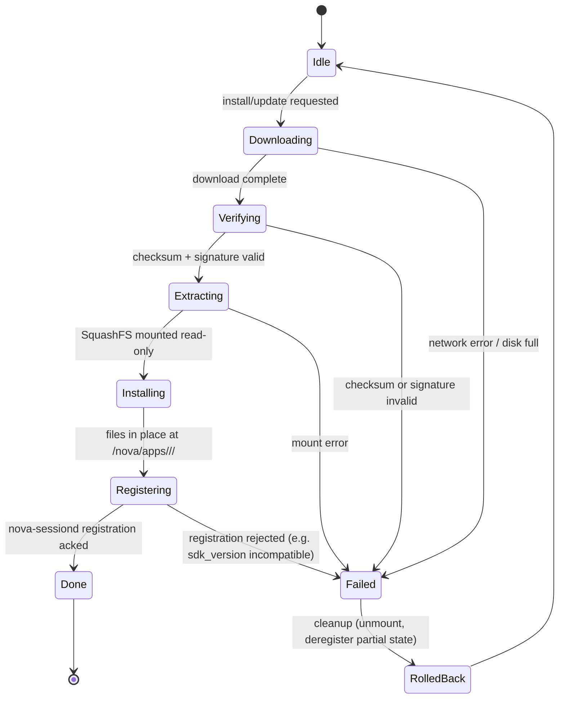
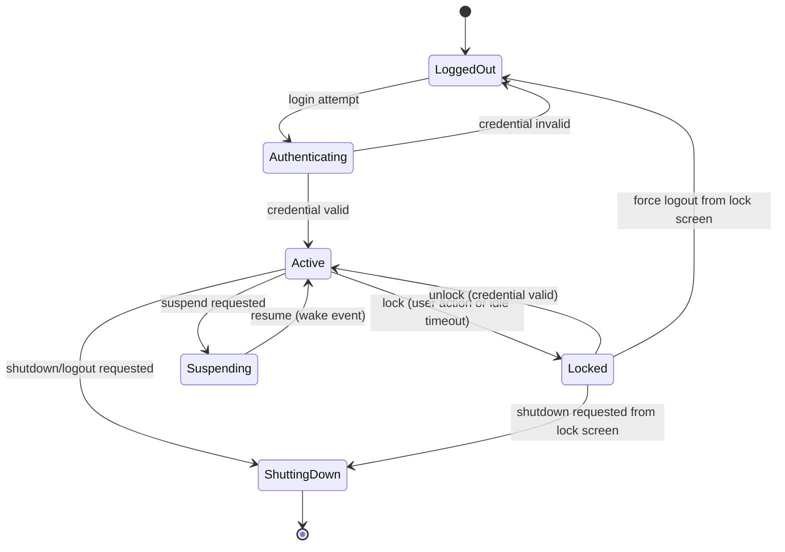
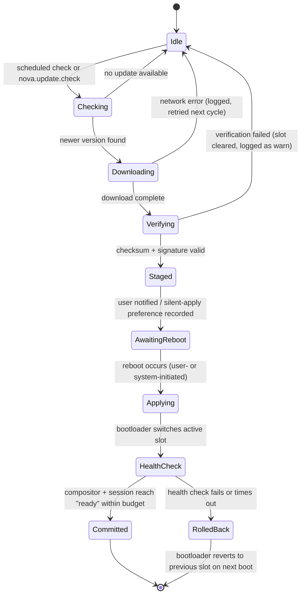
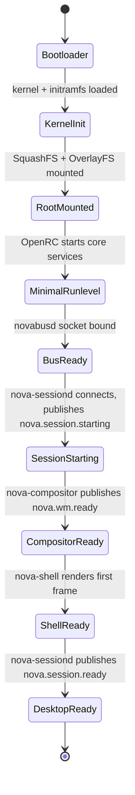
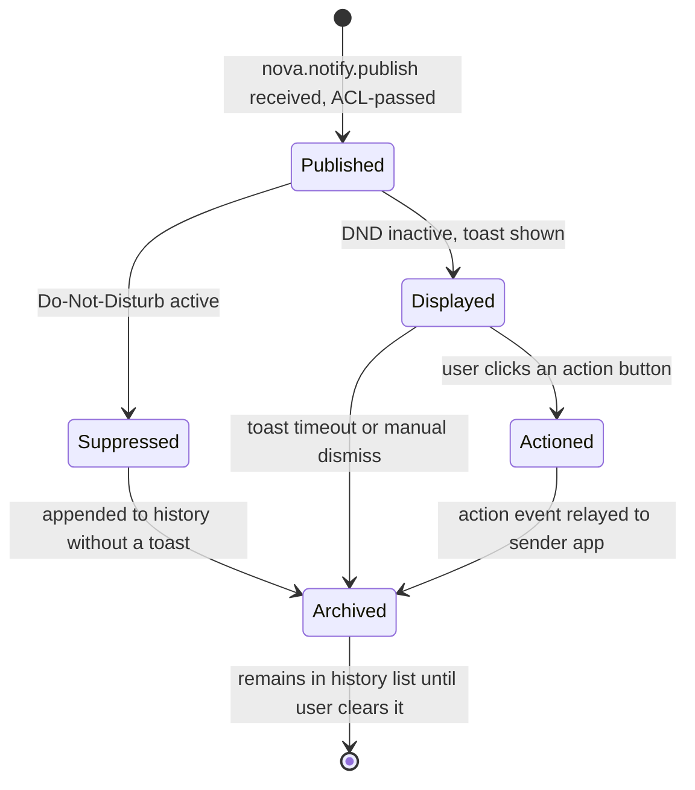

# Spec 16 — Consolidated State Machines

Status: Draft v0.1 · Last updated: 2026-07-18

Every subsystem's state machine in one referenceable place, per Staff Engineer review.
Two are defined elsewhere and only indexed here to avoid duplication; the rest are new.

## 0. Index

| Subsystem | Defined in |
|---|---|
| Window lifecycle | [04-WINDOW-MANAGER-SPEC.md](04-WINDOW-MANAGER-SPEC.md) §1 |
| App lifecycle | [06-NOVA-SDK-SPEC.md](06-NOVA-SDK-SPEC.md) §2 |
| Package install/update | §2 below |
| User session | §3 below |
| OS update | §4 below |
| Boot | §5 below |
| Notification | §6 below |

## 1. Conventions

Every state machine below uses the same notation and the same rule:
**every transition is triggered by exactly one named event, and every state has an
explicit, documented set of outgoing transitions — there is no implicit "anything can
happen from any state."** A transition not shown is not possible; code that attempts one
is a bug, not an unspecified edge case.

## 2. Package Manager (Install/Update)

Owned by `novapkg-agent` ([RFC-0004](../rfcs/RFC-0004-package-service.md)); format
referenced is [07-PACKAGE-FORMAT-SPEC.md](07-PACKAGE-FORMAT-SPEC.md).

Every `Failed` transition publishes `nova.package.install_failed` with the specific
`error_code` before entering `RolledBack`
([RFC-0004](../rfcs/RFC-0004-package-service.md) Failure Modes) — `RolledBack` always
returns to `Idle` with no partial state left on disk or registered with
`nova-sessiond`, matching that RFC's "no state that leaves an app half-registered"
guarantee.

## 3. User Session

Owned by `nova-sessiond` ([RFC-0008](../rfcs/RFC-0008-session-manager.md)).

`Suspending`/resume is the one state pair that involves the kernel's own power
management directly ([../01-SYSTEM-ARCHITECTURE.md](../01-SYSTEM-ARCHITECTURE.md) §5) —
`nova-sessiond` publishes `nova.session.locked`/`unlocked` on the `Active ↔ Locked`
transitions only; suspend/resume does not implicitly lock (a user may configure
"lock on suspend" as a Nova Settings preference, which if enabled inserts an
`Active → Locked` transition immediately before `Suspending`, rather than being a
distinct state combination).

## 4. OS Update

Owned by `update-agent` ([RFC-0009](../rfcs/RFC-0009-update-service.md)); the final two
transitions span a reboot and are partially owned by the bootloader, noted explicitly.

`Applying` → `HealthCheck` → `Committed`/`RolledBack` happens entirely within the boot
sequence ([03-BOOT-TIMELINE.md](03-BOOT-TIMELINE.md)), not inside a running
`update-agent` process — `update-agent` itself has already exited by `Staged`/
`AwaitingReboot` (it is not resident,
[RFC-0009](../rfcs/RFC-0009-update-service.md) Startup Order) and only resumes its own
`Idle` state after the *next* successful boot confirms `Committed`.

## 5. Boot

Cross-references the timelines in [03-BOOT-TIMELINE.md](03-BOOT-TIMELINE.md); presented
here as a state machine to make the "every stage has exactly one predecessor and one
successor, no skipping" property explicit — boot is a linear chain, not a graph, which
is precisely what makes it possible to give it a hard time budget at all.

Note this is strictly narrower than
[01-INTERACTION-FLOWS.md](01-INTERACTION-FLOWS.md) §8's message-level view (which also
shows the boot-animation client's parallel lifecycle) — this diagram is the
critical-path state sequence only, the one the CI boot-milestone-ordering assertion
([../10-TESTING-AND-BUILD.md](../10-TESTING-AND-BUILD.md) §2 stage 4) checks against.

## 6. Notification

Owned by the notification subsystem inside `nova-shell`
([RFC-0005](../rfcs/RFC-0005-notification-service.md)) — deliberately the simplest state
machine in this document, reflecting that notifications are intentionally a lightweight,
best-effort mechanism (§Failure Modes in that RFC).

`Archived` is a terminal state for the state machine (no further automatic
transitions) but not a terminal *record* — history persists via `nova-storage`
([RFC-0005](../rfcs/RFC-0005-notification-service.md) Recovery Strategy) until the user
explicitly clears it, which is a UI action outside this state machine's scope (deleting
a record, not transitioning a live notification's state).
